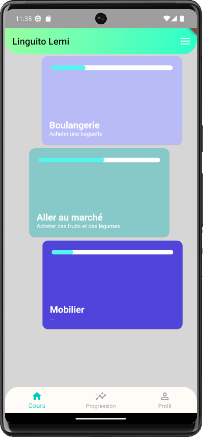
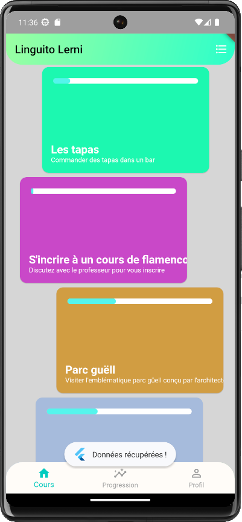

[](https://choosealicense.com/licenses/mit/)

# Linguito Lerni

Open-source learning language app

## Install Flutter
https://docs.flutter.dev/get-started/install

## Installation

```bash
  flutter pub get
```

## Environment Variables

To run this project, you will need to add the following environment variables to your .env file

`API_URL` This is a prod environment variable. For dev environment, url is set directly in http_client.dart.

`ENV` "prod"/"dev"

## API

Use the [course-editor api](https://github.com/JhanaPF/Collaborative-Dictionnary)

## Installation

Install emulators first.
Run your device.

```bash
  flutter run
```

## Color Reference

| Color             | Hex                                                                |
| ----------------- | ------------------------------------------------------------------ |
| Frostbite |  #F02EBA |
| Indigo |  #50006C |
| Fluorescent Blue  |  #31F2E7 |
| Eucalyptus |  #31F296 |


## Logo


## Screenshots

  <p style="display: flex; justify-content: center; text-align:center;">
      
      
      
  </p>

## Contributing

If you'd like to contribute to this project, follow these steps:

1. Fork the project.
2. Create a branch for your feature: `git checkout -b my-feature`.
3. Make your changes.
4. Commit and push your changes: `git commit -m "Add my feature"`.
5. Create a pull request.
6. Add your name in CONTRIBUTORS.md  

## License

This project is licensed under the MIT License - see the [LICENSE](LICENSE) file for more details.